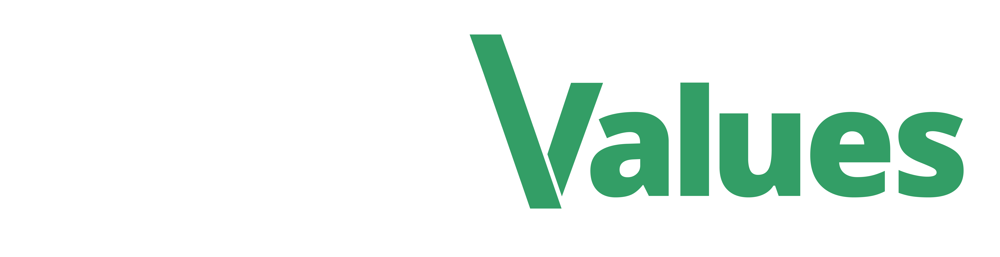

# Sthack x Hack4values 2025 !

## Bug Bounty Solidaire - Sthack 2025

‍
Cette année encore, la Sthack est très fière de collaborer avec l'[ONG Hack4Values](https://hack4values.eu) pour proposer une épreuve de Bug Bounty solidaire.

Hack4Values aide les organisations non gouvernementales à se protéger contre les menaces cyber et à renforcer la sécurité de leurs plateformes web.
‍
Le Bug Bounty solidaire de cette année concernera les associations Surfrider et Handicap International.

## Informations Générales

Date de pré-ouverture : Mardi 20 mai à 12h

Date de clôture : Dans la nuit du CTF de la Sthack le vendredi 23 mai

Participants éligibles : Seules les équipes inscrites aux CTFs sont invitées à participer au programme.

## Scope du programme

### Informations Générales

- Utilisez ce lien pour accéder au programme de VDP pour surfrider :
  https://app.yogosha.com/cvd/hack4values/40orUdMG3WRKOpXmRVN5oA
- Ce lien pour handicap International :
  https://app.yogosha.com/cvd/hack4values/27A5LaOH2iN1DxiDiCYNiL

- ‍Enregistrez-vous une première fois.
- Votre nom d'utilisateur doit suivre le pattern suivant : "team-player".
- Exemple : si vous jouez pour l'équipe Hack4Values et que votre pseudo est Bask, inscrivez-vous en tant que "hack4values-bask"
- Configurez la 2FA et validez votre adresse e-mail.
- Soumettez votre rapport. Un même compte peut être utilisé par tous les membres d'une équipe.
  ‍

## Scope SurfRider

- \*.surfrider.fr

## Scope Handicap International

Le périmètre de ce Bug Bounty couvre **uniquement** les domaines et sous-pages suivants :

- https://www.handicap-international.at
- https://www.hi-canada.org
- https://www.handicap-international.lu
- https://www.handicapinternational.be
- https://www.handicap-international.ch
- https://www.handicap-international.de
  - https://www.handicap-international.de/de/kontakt
  - https://www.handicap-international.de/de/newsletter-anmeldung-neu
  - https://www.handicap-international.de/de/neuigkeiten/warnung-vor-betrugerischen-spendensammlern
- https://www.humanity-inclusion.org.uk/en/contact
- https://www.humanity-inclusion.org.uk/en/campaign/stop-bombing-civilians-sign-the-petition
- https://www.humanity-inclusion.org.uk/en/sign-up-for-email-updates
- https://www.humanity-inclusion.org.uk/en/fundraise/london-marathon
- https://www.humanity-inclusion.org.uk/en/fundraise/order-your-fundraising-pack
- http://support.hi.org

---

## À propos

**Handicap International**, également connue sous le nom de **Humanity & Inclusion**, est une ONG internationale qui œuvre pour améliorer la vie des personnes en situation de handicap et des populations vulnérables dans les zones de conflit, de catastrophe ou de grande précarité.

Elle intervient dans plus de **60 pays** via des projets de :

- santé,
- éducation,
- déminage humanitaire,
- plaidoyer pour les droits humains.

---

## Restrictions spécifiques

Merci de respecter les consignes suivantes afin d’éviter toute perturbation des services :

- Limitez votre activité à **150 requêtes par minute maximum**.
- **Pas de spam massif** des formulaires de contact.
- **Ne pas spammer** les modules de don suivants :
  - https://www.handicap-international.at/de/spenden
  - https://www.canadahelps.org/en/dn/59466
- **Ne pas spammer** les formulaires de contact :
  - https://www.hi-canada.org/en/contact
  - https://www.handicap-international.ch/fr/newsletter
- **Ne pas spammer** les formulaires de pétition :
  - https://www.hi-canada.org/en/petition-stop-bombing-civilians
  - https://www.handicap-international.ch/fr/signez-la-petition
- **Ne pas tester** l'inscription à la newsletter :
  - https://handicap-international.us2.list-manage.com/

### Hors périmètre

Les plateformes de donations suivantes **ne sont pas couvertes** par ce Bug Bounty :

- https://jedonne.handicap-international.lu/
- https://donate.handicapinternational.be

## Règles générales

- Les participants doivent respecter les bonnes pratiques du Bug Bounty, en évitant le Social Engineering.
- Toute activité pouvant causer des attaques par déni de service (DOS/DDOS) est strictement interdite.
  ‍
- Les points attribués pour le classement varient en fonction de la gravité des vulnérabilités identifiées :

  - Critical : 15 pts
  - High : 8 pts
  - Medium : 3 pt
  - Low : 1 pt

- Seules les vulnérabilités montrant un impact direct seront éligibles.

* Le score CVSS sera utilisé pour qualifier la criticité des vulnérabilités, mais l'équipe de triage décidera de la criticité finale.

- Les vulnérabilités compromettant la confidentialité et/ou l'intégrité des données des utilisateurs seront revalorisées.
- Le système de Duplicate s'applique sans fenêtre de duplicate autorisée.

## Récompenses

Une récompense unique sera décernée à l'équipe gagnante de ce Bug Bounty H4V dans la nuit du CTF le 23 mai.

## Support

L'équipe de staff est disponible sur le Discord de la Sthack (Canal [h4v-2025](https://discord.com/channels/727150382668709909/1374088671594025030)) pour répondre à toutes vos questions. Le jour de l'événement, le staff et l'équipe de triage seront également disponibles pour toute assistance nécessaire.
