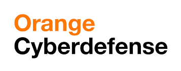
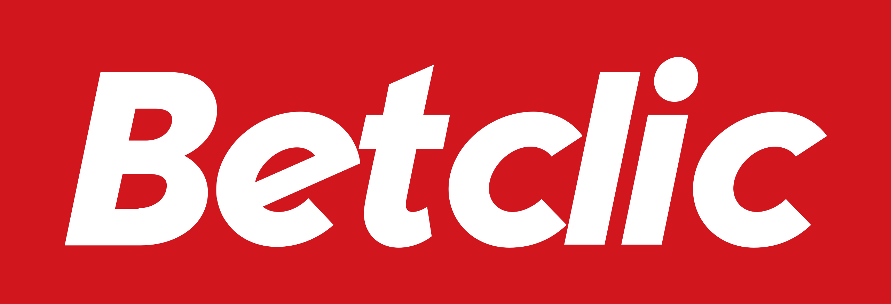
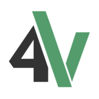
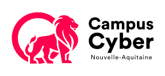
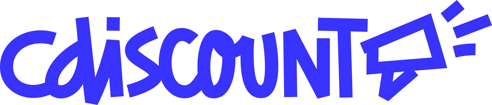
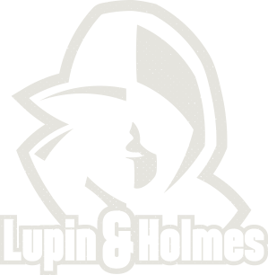

# 2025 edition !

| Conferences |           CTF           |
| :---------: | :---------------------: |
|  9h - 18h   |        20h - 6h         |
| Cité du vin | Les salons de la mairie |

## CFP

CFP is open ! Submit your talks : staff[at]sthack[dot]fr

## Program

### Breakfast

- Location : Cité du vin
- Speaker : Cannelés & Café
- Time : 9:00 - 9:45
- Infos : :)

### Keynote

- Location : Cité du vin
- Speaker : Jeremy Fetiveau
- Time : 9:45 - 10:15
- Infos :

### Pivoting on Evolutions

- Location : Cité du vin
- Speaker : Jared Wilson
- Time : 10:20 - 11:05
- Infos : In 2023 Mandiant released Permhash, an extensible framework to hash declared permissions to empower researchers to perform clustering, hunting, and pivoting. Permhash is currently applied to over 29 million samples. Since its release I have been using Permhash to help identify groups of functionality that are suspicious. I would like to share one highly interesting and novel permhash investigation that led to the identification of an active Android-based credential theft campaign targeting users associated with a South Asia Government and the Financial Sector. Using Permhash to perform this clustering, we identified this new malware family: SILENTSTEP. SILENTSTEP is an Android Package (APK) credential theft malware family that uses SMS for command and control. This research will include how Mandiant has closely tracked the evolutions of SILENTSTEP over the past three months and will dive into the specifics of these technical advancements - demonstrating how detection in depth can be applied to allow for persistent pursuit.

### Rétro-ingénierie de code Objective-C

- Location : Cité du vin
- Speaker : Victor Cutillas
- Time : 11:10 - 11:40
- Infos :

### A look at the security model of the Trezor Safe family

- Location : Cité du vin
- Speaker : Marion Lafon & Charles Christen
- Time : 11:45 - 12:05
- Infos :

### (Pause Déjeuner)

- Location : TBD
- Speaker :
- Time : 12:15 - 14:00
- Infos :

### (Slot libre)

- Location : Cité du vin
- Speaker :
- Time : 14:00 - 14:45
- Infos :

### Tesla Wallconnector

- Location : Cité du vin
- Speaker : David Berard
- Time : 14:50 - 15:25
- Infos :

### (Slot libre)

- Location : Cité du vin
- Speaker :
- Time : 15:30 - 16:15
- Infos :

### (Slot libre)

- Location : Cité du vin
- Speaker :
- Time : 16:20 - 17:05
- Infos :

### RUMPS

- Location : Cité du vin
- Speaker : You
- Time : RUMPS
- Infos : Prepare your best rump !

### CTF Night

- Location : Salons de la mairie
- Speaker :
- Time : 20:00 - 6:00
- Infos : Let's have some CTF tasks! Beers and Food are waiting for you

## CTF

"Capture the Flag" is a kind of compeon where people can practice offensive IT security. The "Flags" are passwords participants can obtain after having successfully exploited vulnerabilities in applications specifically developed for the challenge, they simulate confidential information. The Flags cost points, and the team that earns the most of point win the compeon.

At Sthack, teams are made up of 5 members max which fight for 12 hours. The points are calculated taking account of the teams that hack the challenge (Chall01 = 50\*(NbTeams-NbTeamsThatSolvedChall01)). You can expect web applications, network forensic, reverse engineering, [steganography](https://www.youtube.com/watch?v=dQw4w9WgXcQ) and software exploitation.

## Sponsors

[Sponsor the event](./Sthack%20-%20Sponsoring%202025.pdf)

|                                                                                                             |                                                                                               |                                                                                                         |
| ----------------------------------------------------------------------------------------------------------- | --------------------------------------------------------------------------------------------- | ------------------------------------------------------------------------------------------------------- |
|  |    |         |
|                              |     |                      |
|                 |  |                                |
|              |  |  |
|                             |  |                   |

