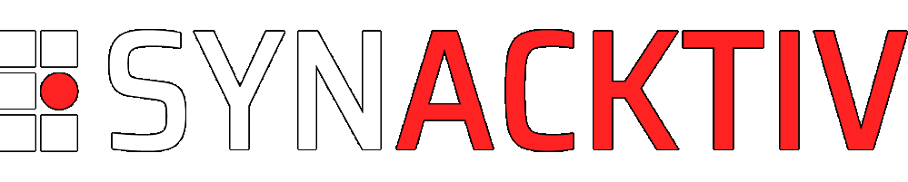

# 2025 edition !

| Conferences |           CTF           |
| :---------: | :---------------------: |
|  9h - 18h   |        20h - 6h         |
| Cité du vin | Les salons de la mairie |

## CFP

CFP is open ! Submit your talks : staff[at]sthack[dot]fr

## Program

Program is under construction :) come back soon !

### Breakfast

- Location : Cité du vin
- Speaker : Cannelés & Café
- Time : 9:00 - 9:45
- Infos : :)

### Keynote

- Location : Cité du vin
- Speaker : Jeremy Fetiveau
- Time : 10:00 - 10:15
- Infos :

### Demystifying Objective-C internals

- Location : Cité du vin
- Speaker : Victor Cutillas
- Time : 10:20 - 11:05
- Infos : Reverse engineering iOS userland code may seem intimidating but worry not, Objective-C and its runtime are your friends! This talk aims to give iOS newcomers the keys to efficiently reverse engineer Objective-C implementations through real-world examples. Recovering data structures, object methods & variable types will become your new hobby ;) An IDA plugin is also presented to improve analysis experience

### Reversing modern mobile games

- Location : Cité du vin
- Speaker : Thomas WEBER
- Time : 11:10 - 11:40
- Infos : A case study of reversing a recent mobile game

### Look at the Windows named pipe

- Location : Cité du vin
- Speaker : Thomas Borot
- Time : 11:45 - 12:15
- Infos :

### (Lunch)

- Location : TBD
- Speaker :
- Time : 12:15 - 14:00
- Infos :

### Le risque de surveillance dans nos démocraties

- Location : Cité du vin
- Speaker : Elia Verdon & Yoann Nabat
- Time : 14:00 - 14:45
- Infos : Une présentation globale des dispositifs de surveillance en France et des risques qu'ils présentent pour nos libertés fondamentales.

### A look at the security model of the Trezor Safe family

- Location : Cité du vin
- Speaker : Marion Lafon & Charles Christen
- Time : 14:50 - 15:20
- Infos :

### Small break

### Pivoting on Evolutions

- Location : Cité du vin
- Speaker : Jared Wilson
- Time : 15:40 - 16:25
- Infos : In 2023 Mandiant released Permhash, an extensible framework to hash declared permissions to empower researchers to perform clustering, hunting, and pivoting. Permhash is currently applied to over 29 million samples. Since its release I have been using Permhash to help identify groups of functionality that are suspicious. I would like to share one highly interesting and novel permhash investigation that led to the identification of an active Android-based credential theft campaign targeting users associated with a South Asia Government and the Financial Sector. Using Permhash to perform this clustering, we identified this new malware family: SILENTSTEP. SILENTSTEP is an Android Package (APK) credential theft malware family that uses SMS for command and control. This research will include how Mandiant has closely tracked the evolutions of SILENTSTEP over the past three months and will dive into the specifics of these technical advancements - demonstrating how detection in depth can be applied to allow for persistent pursuit.

### Attaquer le Tesla Wall Connector via son connecteur de port de charge

- Location : Cité du vin
- Speaker : David Berard
- Time : 16:25 - 17:10
- Infos : Cette présentation décrit la méthode d’attaque utilisée lors de la compétition Pwn2Own Automotive Tokyo 2025 pour compromettre un chargeur Tesla Wall Connector en exploitant via son de port de charge. Elle débute par une explication du fonctionnement d’un chargeur de véhicule électrique et des différents signaux impliqués. Tesla utilise un protocole de données bidirectionnel propriétaire permettant la communication entre le Wall Connector et les véhicules de la marque ; ce protocole sera détaillé. Une vulnérabilité logique permettant l’exécution de code arbitraire sur l’appareil sera présentée, suivie de la conception d’un équipement dédié à la communication et à l’exploitation de cette vulnérabilité. La présentation s’achèvera par une évaluation des impacts et des implications de cette faille.

### RUMPS

- Location : Cité du vin
- Speaker : You
- Time : 17:15 - 18
- Infos : Prepare your best rump !

### CTF Night

- Location : Salons de la mairie
- Speaker :
- Time : 20:00 - 6:00
- Infos : Let's have some CTF tasks! Beers and Food are waiting for you

## CTF

"Capture the Flag" is a kind of compeon where people can practice offensive IT security. The "Flags" are passwords participants can obtain after having successfully exploited vulnerabilities in applications specifically developed for the challenge, they simulate confidential information. The Flags cost points, and the team that earns the most of point win the compeon.

At Sthack, teams are made up of 5 members max which fight for 12 hours. The points are calculated taking account of the teams that hack the challenge (Chall01 = 50\*(NbTeams-NbTeamsThatSolvedChall01)). You can expect web applications, network forensic, reverse engineering, [steganography](https://www.youtube.com/watch?v=dQw4w9WgXcQ) and software exploitation.

## Sponsors

[Sponsor the event](./Sthack%20-%20Sponsoring%202025.pdf)

|                                                                                                                                   |                                                                                               |                                                                                                         |
| --------------------------------------------------------------------------------------------------------------------------------- | --------------------------------------------------------------------------------------------- | ------------------------------------------------------------------------------------------------------- |
|                        |    |         |
|                                                    |     |                      |
|                                       |  |                                |
|                                    |  |  |
|                                                   |  |                   |
|  |           |                                                                                                         |

