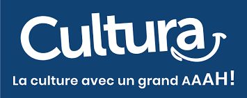
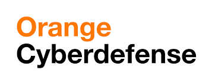
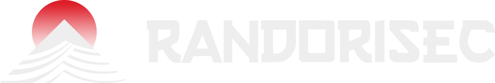
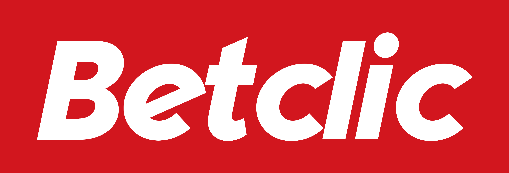
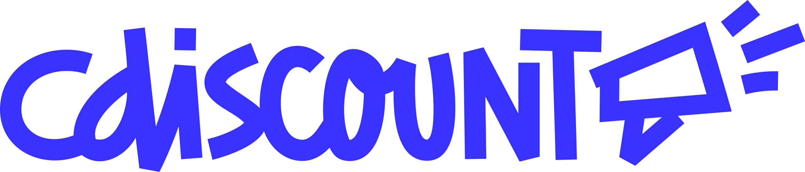
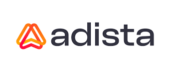
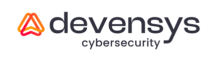
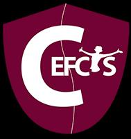
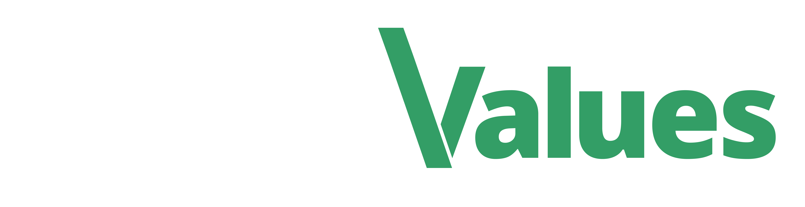
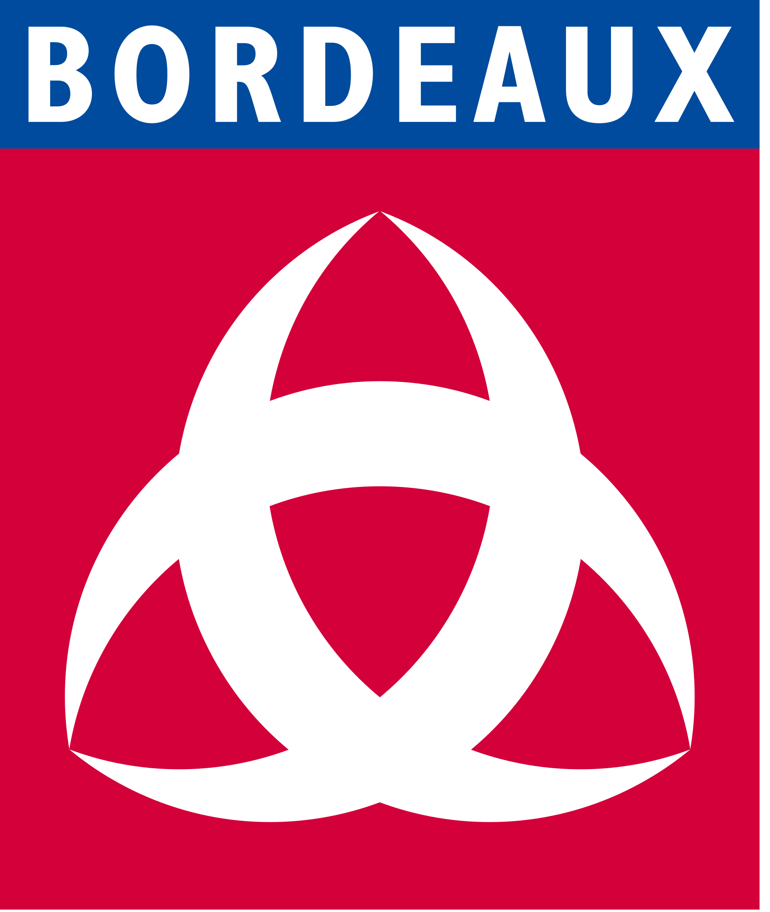

# 2026 edition

| Conferences |           CTF           |
| :---------: | :---------------------: |
|  9h - 18h   |        20h - 6h         |
| Cité du vin | Les salons de la mairie |

Looking for CTF Lunch ? : [See Here](/editions/2026/repas)

Looking for CTF rules ? : [See Here](/editions/2026/ctf)

## Program

Conferences location : Cité du vin.

### Breakfast

- Speaker : Cannelés & Café
- Time : 9:00 - 9:45
- Infos : :)

### Keynote

- Speaker : Roni "0xLupin" Carta
- Time : 10:00 - 10:30
- Infos : Keynote

### Trust Issues: How Upstream Dependencies Turn Their Attack Surface Into Yours

- Speaker : Garance de la Brosse
- Time : 10:30 - 11:15

GitHub Actions workflows have become a critical part of modern software supply chains — and a high-value target for attackers.

In this talk, we present a set of attack techniques against GitHub Actions that lead to remote code execution on CI runners and exfiltration of repository secrets. We show how these primitives can be chained to inject malicious code into a victim's codebase, tamper with releases, and even publish packages on behalf of the targeted organisation, turning a misconfigured workflow into a full supply-chain compromise.

### Synthetic Sthackframe, ou l'art de manipuler la stack pour effacer les traces

- Speaker : BlackWasp
- Time : 11:15 - 12:00

Les EDR modernes ne se contentent plus de hooker ntdll : ils inspectent désormais la pile d'appel au moment des syscalls sensibles, à la recherche d'adresses de retour incohérentes, comme des régions exécutables non backées par un fichier sur disque, signature classique d'un shellcode injecté.

Et si la pile pouvait être masquée ?

### (Lunch)

- Location : TBD
- Time : 12:15 - 14:00
- Infos :

### What We Didn't Publish About SHADOW-VOID-042

- Speaker : Daniel Lunghi
- Time : 14:00 - 14:30

This presentation dissects campaigns attributed to SHADOW-VOID-042, a Russia-aligned intrusion set, highlighting advanced adversary tradecraft.

The attack combines convincing social engineering (HR harassment complaints, research invitations, and spoofed Trend Micro security advisories) with browser-based exploitation. We'll walk through the technical kill chain: initial compromise via CVE-2018-6065 and suspected newer vulnerabilities, shellcode injection with custom API hashing, and payloads encrypted per-target using derived machine characteristics.

Attribution challenges and overlaps with Void Rabisu will be discussed. In the last part, we will show how we took advantage of implementation choices on the attacker’s side to analyse additional stages. We will also elaborate on our observations that point towards the usage of more recent vulnerabilities.

### Runtime blindspot : Abusing .NET Runtime Internals to Evade EDRs

- Speaker : Ossama "0x3lk" Ait-El Mouddene
- Time : 14:30 - 15:15

Modern EDR solutions monitor managed .NET execution through two primary lay-ers: Event Tracing for Windows (ETW), which captures assembly-load telemetry from the CLR, and AMSI, which scans assemblies before execution.

Existing bypass tech-niques patching the ETW write function or corrupting AmsiScanBuffer bytes are well-documented and actively detected, as they require modifying protected memory regions and invoking APIs that EDR kernel drivers intercept. This talk presents a systematic offensive analysis of the .NET Common Language Run-time (clr.dll) as a detection blind spot.

We show that both ETW and AMSI can be suppressed by acting on internal CLR variables that live in already-writable memory no memory-permission change, no monitored API call. We also introduce a novel use of Reflection.Emit to generate in-memory assemblies with fully forged identities, breaking name-based EDR heuristics at the source. As a teaser, we open a new research direction: shellcode execution via managed CLR primitives a carrier that current behavioral detection models do not account for.

All contributions are validated by a proof-of-concept loader that deploys a Mythic C2 agent entirely in memory, tested against a commercial top-tier EDR (identity withheld). Result: zero alerts, zero ETW events, zero AMSI invocations.

### Small break

### Invite-only: from invite.php to a 1,400-domain phishing operator

- Speaker : Axel "4rchibald" Zengers
- Time : 15:30 - 16:15

ClickFix est devenu l’une des techniques d’ingénierie sociale les plus utilisées ces derniers mois : une fausse interface, une instruction simple, un exécutable lancé par la victime elle-même.

Mais derrière ces campagnes se cache une infrastructure complexe, et cette infrastructure laisse des traces exploitables. Cette présentation part d’un détail en apparence anodin : un nom de fichier récurrent, invite.php, repéré lors d’une surveillance de routine.

À partir de cet indice, j’applique une série de pivots reproductibles (urlscan, analyse DOM, clustering ASN, DNS SOA, OSINT) pour remonter progressivement vers une infrastructure de plus de 1 400 domaines, et un opérateur cohérent.

L’objectif n’est pas seulement le résultat, mais la méthode : comment formuler une hypothèse, la tester, et enchaîner des pivots exploitables avec des outils publics.

### Red Team : 20 missions plus tard — Autopsie de quatre années de mutation offensive

- Speaker : Cyril "Mayfly" Servieres
- Time : 16:15 - 17:00

La Red Team a profondément changé de nature. En quelques années, les défenses se sont industrialisées, les environnements se sont hybridés, et le centre de gravité de nombreuses compromissions s’est déplacé d’Active Directory vers Azure, Entra ID et les mécanismes d’identité cloud.

Là où certaines opérations offensives produisaient autrefois des résultats rapides, elles génèrent aujourd’hui du bruit, de la télémétrie ou des détections quasi immédiates. Des implants meurent parfois avant même d’obtenir un premier callback stable. Des payloads sont neutralisés en amont par les passerelles de messagerie.

Une part importante du tooling offensif public est désormais bien mieux connue des défenseurs et constitue autant d’indicateurs de compromission prêts à être détectés. Surtout, nombre d’hypothèses historiques de la Red Team ne sont plus valables. Compromettre un poste ne signifie plus nécessairement obtenir une persistance exploitable.

Compromettre Active Directory n’est plus systématiquement le meilleur chemin vers l’entreprise. Aller vite n’est plus toujours la meilleure stratégie. Cette présentation propose un retour d’expérience sur cette mutation.

### RUMPS

- Location : Cité du vin
- Speaker : You
- Time : 17:00 - 18
- Infos : Prepare your best rump !

### CTF Night

- Location : Salons de la mairie
- Speaker :
- Time : 20:00 - 6:00
- Infos : Let's have some CTF tasks! Beers and Food are waiting for you

## CTF

"Capture the Flag" is a kind of compeon where people can practice offensive IT security. The "Flags" are passwords participants can obtain after having successfully exploited vulnerabilities in applications specifically developed for the challenge, they simulate confidential information.

[About 2026 CTF](/editions/2026/ctf)

## Sponsors

[Sponsor the event](/Sthack%20-%20Sponsoring%202026.pdf)

|                                                                                                     |                                                                                                             |                                                                                                |
| --------------------------------------------------------------------------------------------------- | ----------------------------------------------------------------------------------------------------------- | ---------------------------------------------------------------------------------------------- |
|                   |  |              |
|  |                              |   |
|           |                     |           |
|        |                                |                  |
|                |                                  |  |
|                                                                                                     |              |                                                                                                |

